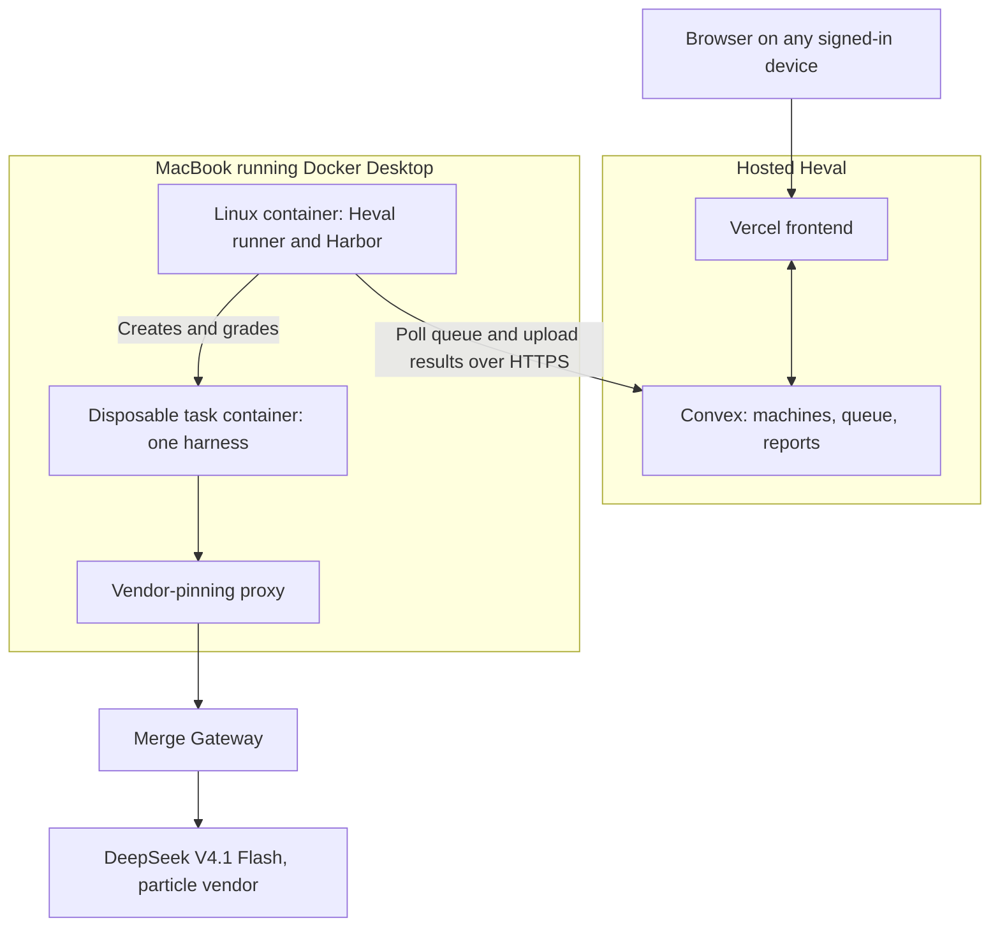
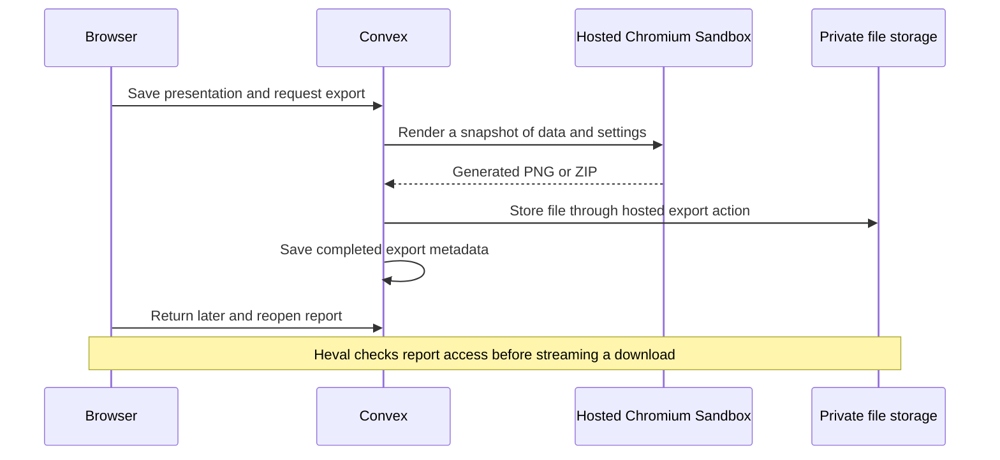

# Three coding harnesses, one model, and a MacBook worker

I wanted to compare coding harnesses while keeping the model fixed: Codex CLI,
Claude Code, and Pi, all calling DeepSeek V4.1 Flash through Merge Gateway.
Before measuring their coding ability, I needed to answer a more basic question:
can all three run the same task, get graded, and save results to my account without
depending on an open browser tab?

The first working piece was a tiny smoke test. The task asks an agent to create
`/app/hello.txt` containing exactly `hello from heval` followed by a newline.
The verifier checks the file contents and writes a binary reward. This tests
execution and reporting, not which harness is better at software engineering.

## The architecture

My development environment is Try Omarchy, a Linux VM running on an Apple Silicon
MacBook. That VM was almost out of disk space. The Mac already had Docker Desktop
with about 17.5 GiB of memory allocated, so I used that existing capacity.

Heval's connected runner currently requires Linux. We put it in a Linux container
on Docker Desktop. Harbor talks to the same Docker engine and starts separate
sibling containers for the actual tasks. There is no second Docker daemon inside
the runner, and no extra Linux VM to manage manually.

The model runs at the inference provider. The Mac supplies the tools, filesystem,
container execution and grading. No local model GPU is needed.

SSH from Omarchy into macOS was useful for setup and troubleshooting. Evaluation
coordination uses outbound HTTPS from the worker to Convex. Once paired, the
worker doesn't need a browser or SSH session to remain open. The Mac and Docker
must still stay running; laptop sleep suspends this worker.

## Prove the plumbing before calling a model

The first run used Harbor's Oracle agent, which executes the supplied reference
solution without making a model API call. That exercised Docker creation, task
execution, grading and log collection. A second Oracle run went through the
hosted queue and saved a private report in the account that paired the machine.

Pairing is separate from model authentication. A one-time code from Heval's
Machines page links the worker to the signed-in account. The Merge credential
stays on the worker. Vercel and Convex deployment keys are not needed there.

## Same model, three API surfaces

The authenticated Merge catalog confirmed `deepseek/deepseek-v4.1-flash` was
available. We selected `particle` as the serving vendor and pinned it for every
harness. The proxy records the vendor reported by each response so we can check
what actually served the request.

| Harness | Pinned version | Merge API surface |
| --- | --- | --- |
| Codex CLI | 0.154.0 | Responses |
| Claude Code | 2.1.270 | Anthropic Messages |
| Pi | 0.85.1 | Chat Completions |

Each model trial uses one attempt on the same task, two CPUs, 2 GiB of task memory,
and a 180-second agent execution limit. Runs are sequential, with no automatic
Harbor retries. Agent installation and grading have separate time allowances.
A time limit does not enforce a dollar budget.

These are harness compatibility checks using their configured defaults. Matching
the model and machine does not make prompts, tools, reasoning settings or
compaction behavior equivalent. Those differences need to be recorded for the
larger study.

## What broke along the way

**SSH access was enabled, but the account wasn't allowed.** macOS showed the full
display name in the allowed-users list while SSH used the short username. The logs
identified a service access-control denial. Adding the account restored access;
the logs did not establish why its permission had changed.

**Keychain access differed between local and remote terminals.** The SSH session
couldn't read the Merge credential. A small script run locally in macOS Terminal
read it from Keychain and wrote a mode-0600 worker environment file without
printing the value. Keychain indirection alone doesn't prevent shell environment
snapshots from capturing exported secrets, so credentials stay out of the source
transfer and published evidence.

**Container paths mattered.** The worker bind-mount uses the same absolute path
on macOS and inside Linux. Harbor submits those paths to Docker Desktop when it
mounts task logs. A different internal path would refer to the wrong location
from the Docker engine's perspective.

**The prepared Codex configuration needed updating.** Harbor 0.23.0 interprets a
string-valued agent config as a file path. Our generator supplied a JSON string.
Changing it to an object fixed the pre-inference failure. The failed attempt
remains in run history; the corrected trial is a separate run.

**Node's recursive copy hit a shared-filesystem error.** The first setup-profile
copy failed on Docker Desktop's bind mount. Recreating the partial task copy with
the JavaScript traversal path completed initialization. The actual queued task
snapshot and log mounts then worked. The setup-profile initializer now uses
explicit traversal too, and the CLI regression suite passes. The container recipe
is still a manual setup, not a general installer.

## Measured results

The local Oracle setup check passed with reward 1.0, zero exceptions and a
17-second total runtime. The account-linked Oracle run also passed and uploaded
its report. All three model-backed trials then passed:

| Harness | Task result | Agent execution time | Generation requests |
| --- | --- | --- | --- |
| Codex CLI | Pass | 5.878 s | 2 |
| Claude Code | Pass | 20.243 s | 4 |
| Pi | Pass | 91.861 s | 5 |

These are single observations on a trivial task, with different harness defaults.
Agent time excludes installation and is not end-to-end job time. The table is
execution evidence, not a latency ranking. All 11 generation requests returned
HTTP 200 and reported `particle` as the serving vendor. Ancillary Claude endpoint
probes returned 401; these were separate from the successful generation requests.

Pi's trajectory was instructive even on this small task. It wrote the file,
attempted to inspect it with an unavailable `xxd` command, used another shell
utility, and corrected the missing trailing newline before passing. That is the
kind of tool behavior a final success score alone would hide.

Cost accounting needs more work. Codex and Pi exported no usable cost figure;
Claude exported a harness-reported estimate that we have not reconciled with
Merge billing. Missing cost is not zero, and we are not publishing a cost ranking.
Token totals also need provider-side reconciliation before a full study.

The sanitized [smoke-test evidence](../evidence/macbook-three-agent-smoke.json)
records versions, resource limits, normalized measurements and routing checks.
Private report IDs, credentials and raw trajectories are omitted.

## From a run to a presentation

A completed run uploads normalized trial results to a private saved report. Raw
agent trajectories and execution logs remain on the worker. The initial three profiles created separate reports. We subsequently added an
Evaluations page: choose a worker and task set, select harnesses and models,
choose a vendor, adjust attempts under Advanced settings, then start from the live summary. A saved experiment
page groups the child runs and their results. Existing smoke reports are retained
as individual runs; they are not silently regrouped.

Presentation rendering is a separate workflow:

New presentations start with a neutral White theme; Black is another choice and
Merge branding is opt-in. The saved presentation stores the selected theme,
question, models and chart settings. Export captures those settings and data,
so editing a draft later doesn't change an existing file.

The Mac worker can be offline once results have uploaded: editing and hosted
exports still work. Current social-chart presets compare models within a single
harness/cohort. The experiment page now compares the selected harness/model combinations;
a combined presentation with cross-harness social charts is still separate work.

## What this enables next

This tiny task is an admission test for a larger experiment. The next step is a
pinned set of real coding tasks, repeated attempts, randomized harness order and
verified cost accounting. We'll retain setup failures and tool errors alongside
task outcomes. Passing this smoke test establishes a usable execution path; it
isn't evidence that one harness is more capable or faster on real work.

The operational instructions are in the [worker walkthrough](../three-agent-smoke-walkthrough.md)
and the [Docker Desktop worker notes](../../deploy/docker-desktop-worker/README.md).
