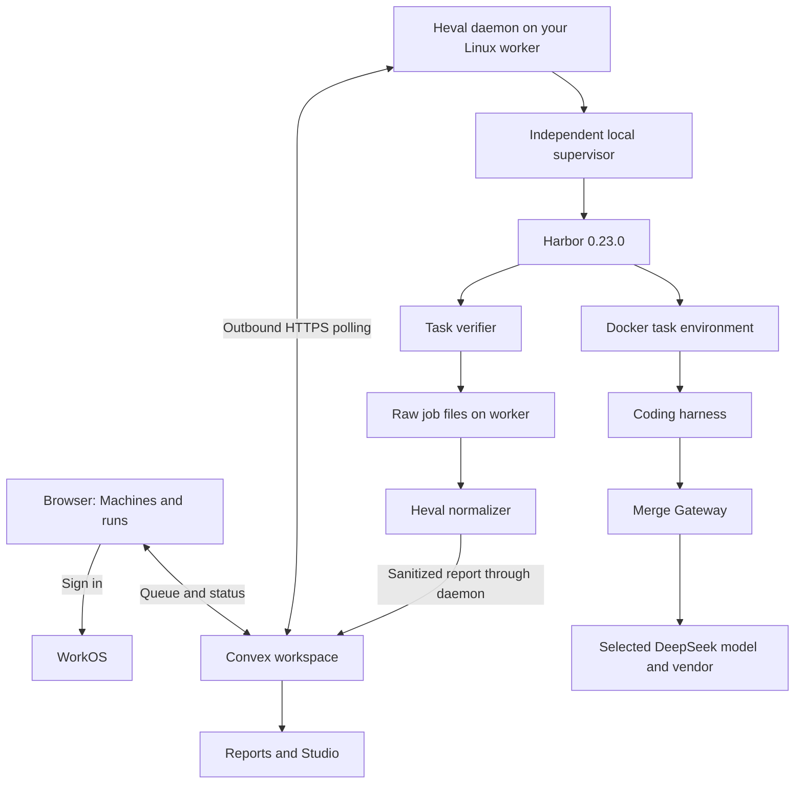

# Current architecture and running an evaluation

Checked against the working tree on 2026-09-17, with Harbor 0.23.0. This describes
implemented code, not a guarantee that the public deployment has this revision.

Heval is the workspace around an evaluation: selecting approved runs, tracking
machines, importing results, inspecting trials, and making reports. Harbor is
the engine that executes benchmark tasks. The coding harness (Codex, Claude Code,
Pi, etc.) is the agent being evaluated. Merge Gateway routes that agent's model
requests. Docker provides the task environment; the task's verifier grades the
result. Those are five separate responsibilities.

## The application today

| Component | Responsibility | Code |
| --- | --- | --- |
| React/Vite frontend | Landing/demo, machines, reports, Studio | `src/`, `vite.config.ts` |
| WorkOS authentication | User sign-in and access tokens | `src/AuthBoundary.tsx`, `convex/auth.config.ts` |
| Convex backend | Machine ownership, pairing, queue, run status, saved reports and sharing | `convex/runners.ts`, `convex/reports.ts` |
| Node Heval CLI | Local results viewer and connected-machine daemon | `packages/cli/src/` |
| Local supervisor | Runs Harbor independently of the browser/daemon, enforces deadline, handles cleanup, exports results | `packages/cli/src/runner/supervisor.ts` |
| Harbor | Agent installation, task environments, attempts, execution and verification | External Python tool, pinned in `harbor/toolchain.json` |
| Report normalizer + charts | Converts raw trials to consistent data; renders tables/charts/exports | `harbor/report/`, `src/charts/`, `src/studio/` |
| Older Bun server | Separate fixture runner, inference proxy and image/video export services | `server/` |

The hosted workspace is configured for Vercel + Convex + WorkOS. Vercel serves
the web application; your connected Linux machine executes Harbor/Docker.
The website does not provision a VM or run Docker in the browser. Planned Vercel
Sandbox work is not the implemented connected-runner path.



A **task** is one problem, environment and grader. A **trial** is one attempt by
one agent/model on one task. A **job** collects trials. For example, four harnesses
× ten tasks × three attempts means 120 trials, with the model held constant.
The verifier determines correctness; the model saying “done” is not a pass.

## Which page does what?

- `/`: product introduction and recorded demo. In Bun deployments the older live
  workbench can also appear; a demo animation is not a new model run.
- `/machines` (also `/evaluations`): pair a worker, choose a locally approved
  profile, queue/cancel runs, monitor status and open completed reports.
- `/reports`: import normalized JSON, save private reports and manage access.
- `/studio`: analyze results and edit chart/presentation settings. Editing a chart
  does not run another evaluation or change its trial outcomes.
- `/share`: view an explicitly shared report.
- Local Studio: account-free analysis/export through `bun run studio:local`.

Hosted machines/reports require configured WorkOS and Convex. If either is absent,
those features are not ready merely because the frontend loads. Local Harbor and
local result viewing do not require a Heval account.

## Path A: direct Harbor execution (use this for the DeepSeek study)

This gives full control over multi-harness jobs without the connected UI's
profile restrictions. Run from the repository root on a prepared worker:

```bash
source harbor/deepseek-study/activate.sh
harbor --version                        # 0.23.0
python harbor/deepseek-study/doctor.py
docker info
docker compose version
```

First validate and run the bundled reference-solution check:

```bash
harbor run -c harbor/jobs/heval-setup.json --print-config
harbor run -c harbor/jobs/heval-setup.json
bun run report jobs/heval-setup
bun run studio:local
```

`--print-config` does not execute the job. The next command starts Docker and
uses the Oracle reference solution, so it needs no model key. It checks execution
and grading, not model capability. Open the URL printed by Studio and select or
import `results/harbor/heval-setup.json`. If rerunning, use a new job name/output
directory rather than overwriting a prior result.

For a real model evaluation:

1. Choose and download reviewed tasks. Pin task contents and base-image digests.
2. Write a Harbor job containing agents/model IDs, harness versions, task paths,
   attempts and resource/time limits.
3. Supply provider credentials locally. For the prepared Merge pilot this means
   `OPENAI_API_KEY` for Codex and `ANTHROPIC_AUTH_TOKEN` for Claude Code, both
   holding the Merge credential. Verify the V4.1 catalog entry and a common vendor.
4. Generate/validate the two-agent pilot following the [DeepSeek study guide](../harbor/deepseek-study/README.md#first-pilot-validate-the-protocol-before-comparing-scores).
   Start the vendor proxy before the paid run and use a container-reachable URL.
5. Run `harbor run -c YOUR_JOB.json`. This incurs model/compute costs.
6. Inspect raw `jobs/<job-name>/` artifacts, run `bun run report jobs/<job-name>`,
   then open the normalized JSON in Studio or import it into `/reports`.

Harbor owns the agent and verification lifecycle. Heval normalizes the outcomes
into `TrialRow` data; shared chart code uses those rows for tables and charts.
Missing billing data stays unknown. Keep raw artifacts for audits: a chart alone
is not a reproducible experiment.

Alternatively, the Node CLI can inspect a raw job directly with
`heval open jobs/<job-name>`; it normalizes it on import. It can also open an
existing JSON export. Merely opening results launches no evaluation.

## Path B: launch from the browser on your machine

Build the CLI from this checkout so it contains the updated Harbor health check:

```bash
bun run cli:build
node packages/cli/dist/cli.js --help
node packages/cli/dist/cli.js doctor
```

These are the source-build equivalents of installed `heval` commands. Changing
this checkout does not update an already published npm package or hosted site.

1. Open `/machines` in the matching hosted deployment and sign in.
2. Name your Linux machine and create a pairing code.
3. On that machine, run the displayed command (or the source-build equivalent):
   `node packages/cli/dist/cli.js runner connect --url https://YOUR.convex.cloud`.
   Paste the code when prompted.
4. Run `node packages/cli/dist/cli.js runner start` and keep it running.
5. Wait for **Online**, select **Check this machine**, and click **Run setup check**.
6. Open its saved report. This first profile uses Oracle and no model API calls.
7. Add a model-backed profile to `~/.heval/runner/profiles.json` on the worker,
   with a reviewed job JSON and a private credential `envFile`.
8. Select that advertised profile in the browser and click **Start evaluation**.

See [connected runners](connected-runners.md#3-approve-a-model-backed-evaluation)
for exact profile JSON. The local profile loader only accepts `n_attempts`,
`agents`, and `tasks` at the top level. It adds its own Docker and concurrency
settings. The full two-agent study pilot cannot be pasted into this registry:
make separate one-agent profiles or use direct Harbor execution.

Current connected-profile limits are one agent/model, 1–20 local tasks, at most
60 trials, one concurrent trial and a two-hour maximum job deadline. Allowed
agents are Oracle, Codex, Claude Code, OpenCode, Pi and Terminus 2. This allowlist is
narrower than Harbor's built-in agent list and the homepage's ecosystem logos.
A time limit does not enforce a dollar budget.

The daemon advertises profile digests, claims queued jobs, snapshots task files,
and starts a separate supervisor. That supervisor executes Harbor and writes a
local outcome. The daemon uploads normalized/sanitized results to Convex; raw
logs and provider credentials remain on the machine. In this path provider keys
must come from the profile's private `envFile`; exporting them only in the daemon
shell is insufficient because the supervisor filters inherited environment.

Closing the browser does not stop a run. Restarting the daemon does not kill its
independent supervisor. A host reboot is different: interrupted work is not
silently rerun on another machine. Only queued work can move to a compatible
worker. Each destination needs its own pairing and matching profile/task digest.

## Path C: the older Bun workbench

`bun run start` builds/starts the Bun application. Its live workbench uses
`server/runner.ts` and `server/docker.ts` to run a fixed fixture in a custom
worker container, then grade it in a fresh container. It has its own auth,
provider connections, WebSockets, recordings and model/harness allowlists.
It does **not** dispatch through the connected Harbor runner.

Execution requires `HEVAL_ENABLE_RUNNER=1`, a built worker image, provider/auth
configuration and Docker. Local Studio deliberately disables this runner while
enabling local export services. Use the direct Harbor path for broad benchmark
studies; the fixture workbench is a separate product/testing flow.

## This machine's status

Harbor 0.23.0 is installed and the generated pilot parses with it. The CLI's
doctor, connected health check and help now use the toolchain pin as their shared
source. Docker is still absent, disk is nearly full and Merge model access has
not been tested. The next execution milestone is a reference-solution Docker
check on a larger worker, followed by the paid two-harness protocol pilot.
No Docker or paid model execution was claimed during this update.
