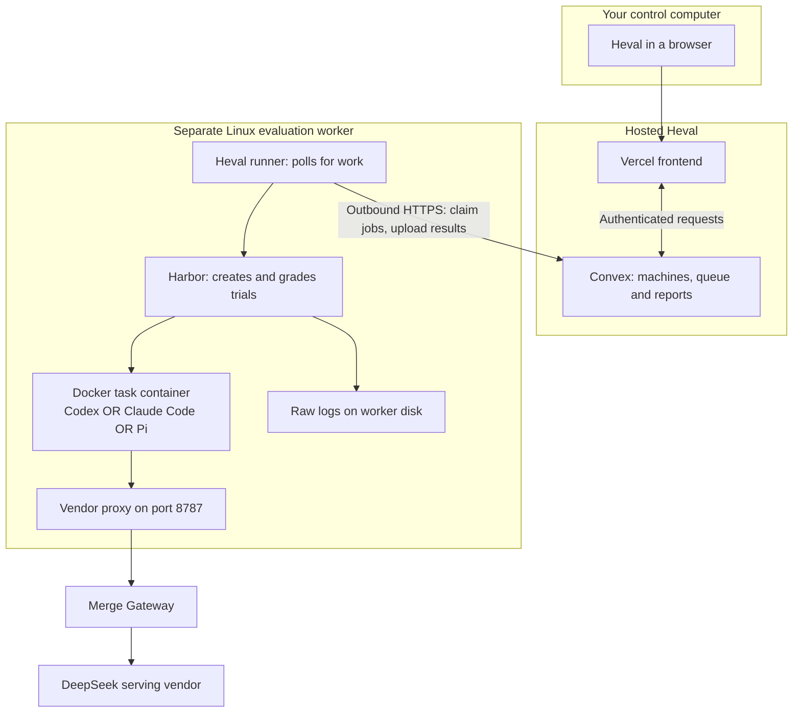
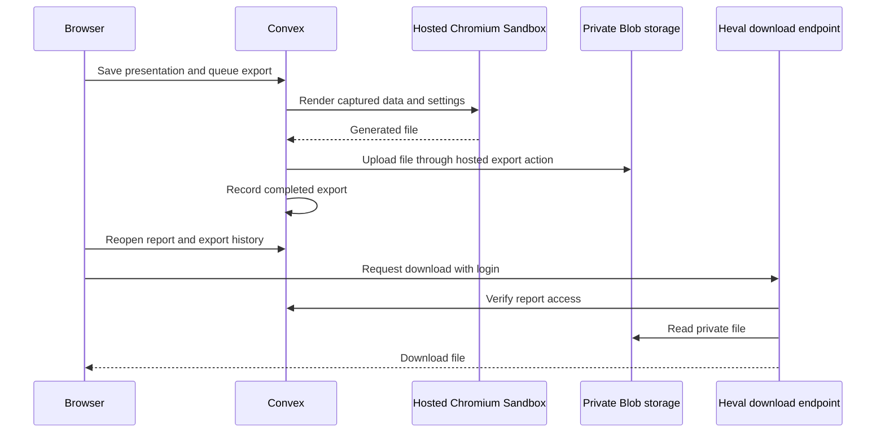

# Three-agent smoke test across machines

**Tested Docker Desktop alternative:** the Linux runner can live in a container
on the Mac’s existing Docker Desktop engine. The Oracle and three model trials
passed on 2026-09-17. See [the Mac worker recipe](../deploy/docker-desktop-worker/README.md)
and [the measured walkthrough](blog/three-harnesses-one-model-macbook-worker.md).
The separate Linux machine instructions below remain another option.

This walkthrough uses the current local checkout. It tests Codex, Claude Code and
Pi against one tiny task using DeepSeek through Merge. It does not measure coding
ability. The authenticated model route and all three protocol round trips still
need live verification. No model inference is run by following steps 1–6.

## Understand the machines

- **Control computer:** your browser, on macOS or the existing Omarchy VM. It
  submits runs and views results. It needs no Docker or agent installations.
- **Hosted services:** Vercel serves Heval; Convex stores machine registrations,
  the queue, normalized results and saved presentations.
- **Evaluation worker:** a separate Linux machine with disk space, Harbor and
  Docker. It can be a Linux VM on your MacBook or a remote Linux server. The
  current connected runner does not run natively on macOS.
- **Inference provider:** Merge routes API calls to the selected DeepSeek serving
  vendor. Model weights do not run on your laptop; no local model GPU is needed.



The runner initiates connections to Convex. You do not open an inbound runner
port. The proxy is for Docker-to-worker traffic; do not expose port 8787 publicly.
Your existing Omarchy VM is not required as an always-on coordinator. Hosted
Heval performs that role.

## 1. Choose and prepare a Linux worker

Use a separate Linux VM on the MacBook, or a remote Linux server. Do not build
images in the current 24 GB Omarchy VM: it was 99% full at the last check.
Start with one concurrent trial. Image installation consumes more disk than the
tiny task itself. A 60–100 GB worker disk gives practical room; task requirements
and actual free space determine whether a larger study fits.

Install Git, Node 22+, Bun, Python 3.12+, uv, Docker Engine and Docker Compose on
that worker. Installation commands depend on the Linux distribution. On an ARM
worker, every chosen task image/tool must support ARM; the setup task uses
python:3.12-slim. Do not mix native and emulated workers in a timing comparison.

**Checkpoint, in the worker terminal:**

```bash
node --version
bun --version
python3 --version
uv --version
docker info
docker compose version
df -h .
```

Fix failures before proceeding. Docker must work as the same user who will run
Heval, not only under sudo.

## 2. Copy the current application source

The prepared scripts and UI changes are still uncommitted locally. Cloning main
alone will not reproduce this setup. From the **existing Omarchy VM**, replace
WORKER_USER and WORKER_HOST with your SSH destination:

```bash
rsync -av --relative \
  --exclude='.git/' --exclude='.tools/' --exclude='node_modules/' \
  --exclude='.env*' --exclude='*.env' --exclude='deploy/' \
  --exclude='.vercel/' --exclude='.scratch/' --exclude='dist/' \
  --exclude='data/' --exclude='jobs/' --exclude='recordings/' \
  --exclude='test-results/' --exclude='playwright-report/' \
  --exclude='harbor/deepseek-study/local/' \
  /home/matt/./heval/ WORKER_USER@WORKER_HOST:~/
```

This copies source into ~/heval, omitting deployment credentials and downloaded
host binaries. The worker needs its own Merge key later; it does not need Vercel
or Convex deployment secrets.

**On the worker:**

```bash
cd ~/heval
bun install --frozen-lockfile
bun run cli:build
uv tool install 'harbor==0.23.0'
harbor --version
node packages/cli/dist/cli.js doctor
```

If Harbor is not on PATH, use `uv tool update-shell` and open a new terminal.
Use this source-built CLI throughout, rather than an older global npm CLI. Do
not run the nine-harness bootstrap: Harbor installs the selected harness inside
its task container.

## 3. Pair the worker with the website

In any browser open:
https://temporary-rushing-violet-xu17m97.vercel.app/machines

Sign in, name your worker, and click **Create pairing code**. On the worker:

```bash
cd ~/heval
node packages/cli/dist/cli.js runner connect \
  --url https://industrious-newt-432.convex.cloud
```

Paste the one-time code at the prompt, then:

```bash
node packages/cli/dist/cli.js runner start
```

Leave this terminal running. The page should show the worker as **Online**.
Pairing grants this worker access to its assigned queue; it is unrelated to
model-provider authentication.

## 4. Run the no-inference setup check

In Machines, choose this worker under **Run on**, then click **Run setup check**. Harbor runs
the Oracle reference solution in Docker and uploads a saved report. No model API
calls are made. Image downloads and remote VM usage can still consume resources.

**Checkpoint:** a completed run and a saved report appear in the browser. If this
fails, fix Docker/connectivity before adding model calls. Once the worker is idle,
stop the runner with Ctrl+C. Keep its state; do not pair again.

## 5. Save the Merge key on the worker

Run these commands on the worker. The key is entered silently, not pasted into
shell history. The script refuses to overwrite an existing file.

```bash
mkdir -p "$HOME/.heval"
read -rsp 'Merge Gateway API key: ' HEVAL_STUDY_KEY; echo
export HEVAL_STUDY_KEY
python3 - <<'PY'
import os
from pathlib import Path
key = os.environ['HEVAL_STUDY_KEY']
if not key or any(c.isspace() for c in key):
    raise SystemExit('Expected a non-empty API key without whitespace')
p = Path.home() / '.heval/merge-study.env'
fd = os.open(p, os.O_WRONLY | os.O_CREAT | os.O_EXCL, 0o600)
with os.fdopen(fd, 'w') as f:
    for name in ('OPENAI_API_KEY', 'ANTHROPIC_AUTH_TOKEN', 'DEEPSEEK_API_KEY'):
        f.write(f'{name}={key}\n')
print(f'Created {p}')
PY
unset HEVAL_STUDY_KEY
```

All three variable names carry the same Merge credential, because the adapters
look up different names. They do not represent three subscriptions. Model calls
use Merge API billing, not your ChatGPT or Claude subscription login.

## 6. Verify routing and prepare the profiles

First inspect the authenticated Merge catalog at
https://api-gateway.merge.dev/v1/models using your credential manager or API
client. Verify access to `deepseek/deepseek-v4.1-flash` and select a serving vendor
that supports the required routes. Do not infer the vendor from older V4 runs.
If the catalog does not establish protocol support, confirm it with Merge before
launching. Live multi-turn compatibility is what the subsequent pilot tests.

Use the same verified vendor for all three. Replace VERIFIED_VENDOR below. Keep
**worker terminal A** running:

```bash
cd ~/heval
bun harbor/proxy/vendor-proxy.ts --vendor VERIFIED_VENDOR \
  --log harbor/deepseek-study/local/three-agent-proxy.jsonl
```

In **worker terminal B**, find the Docker bridge gateway:

```bash
docker network inspect bridge --format '{{(index .IPAM.Config 0).Gateway}}'
```

Use the printed address in place of WORKER_BRIDGE_IP. Verify container access to
the proxy before running a job, for example with a TCP connection from a throwaway
container (downloads the Python image if absent; makes no model call):

```bash
docker run --rm python:3.12-slim python -c \
  'import socket; socket.create_connection(("WORKER_BRIDGE_IP",8787),5).close(); print("Proxy reachable")'
```

This checks the default Docker bridge. Harbor's task networks must also be able
to reach that address; check firewall rules if trials report connection errors.
Keep 8787 restricted to the local container/private network.

Then generate the pilot and profile registry, replacing both placeholders:

```bash
cd ~/heval
python3 harbor/deepseek-study/prepare.py --include-pi \
  --vendor VERIFIED_VENDOR --proxy-url http://WORKER_BRIDGE_IP:8787 \
  --task packages/cli/runner-task \
  --output harbor/deepseek-study/local/three-agent-pilot.json

harbor run -c harbor/deepseek-study/local/three-agent-pilot.json --print-config

python3 harbor/deepseek-study/runner-profiles.py \
  --pilot harbor/deepseek-study/local/three-agent-pilot.json \
  --env-file "$HOME/.heval/merge-study.env" \
  --output-dir "$HOME/.heval/deepseek-three-profiles"
```

Both output locations must be new. These commands prepare configuration; they do
not start inference. The pilot has one task, one attempt per agent and sequential
execution. Each connected profile has a 30-minute overall deadline, including
installation and grading. Time limits are not dollar limits.

## 7. Run the paid three-agent smoke test

In terminal B, start the runner with the new registry:

```bash
node packages/cli/dist/cli.js runner start \
  --profiles "$HOME/.heval/deepseek-three-profiles/profiles.json"
```

In `/evaluations`, select this worker, check only the **Codex CLI** harness and the
DeepSeek V4.1 Flash model, and click **Start experiment**. This starts paid model
calls. Inspect the result before starting new experiments for **Claude Code**, then
**Pi Agent**. They all use the same DeepSeek model;
Codex uses Responses, Claude Code uses Messages, and Pi uses Chat Completions.

**Checkpoint for each:** the task passes grading, logs show actual tool use, and
proxy records show the intended serving vendor. A successfully queued job alone
is not a successful smoke test. Missing/different served-vendor metadata needs
investigation; the current proxy logs mismatches rather than rejecting them.

Keep terminals A and B, the worker and Docker running. Closing the browser is
fine. Sleeping the MacBook interrupts a worker VM running on that MacBook.

## 8. Inspect the result and create a presentation

Open each run's saved report in hosted Heval. The normalized results are in
Convex; raw logs remain on the worker under:

```text
~/.heval/runner/runs/<run-id>/jobs/evaluation
```

A new presentation starts White. Save draft stores your selected theme, question,
models and chart settings with that presentation. Export saves the draft and
queues an immutable render input; it does not rerun the evaluation.



The evaluation worker is not used for presentation exports. Vercel Sandbox
renders charts; it is a separate role from the Linux worker running Harbor.
Browser profiles produce three separate reports. Cross-run assembly and social
charts comparing harnesses are not yet implemented; current social charts require
one harness/cohort. These smoke reports validate execution, not the study winner.

## What to do when something fails

| Symptom | Check |
| --- | --- |
| Worker never becomes Online | Runner terminal, pairing URL, outbound network, Harbor on PATH |
| Setup check fails | Docker permissions, Compose, image pull, available disk |
| Agent cannot reach proxy | Container-reachable address, port 8787, proxy process, firewall |
| Model API returns 401/403 | Worker env file and Merge account access; do not paste keys into logs |
| Model rejects later tool turns | Protocol/reasoning compatibility; keep the failure rather than changing models silently |
| Worker reboot interrupts a run | Inspect state; follow connected-runners.md cleanup instructions before restarting work |
| Preview rejects combined harnesses | Existing chart limitation, not a failed evaluation |

Pair additional workers independently. For an initial harness comparison, run all
three on one worker so hardware is held constant. A remote cloud worker can stay
available while your laptop is closed; a laptop-hosted VM cannot.
